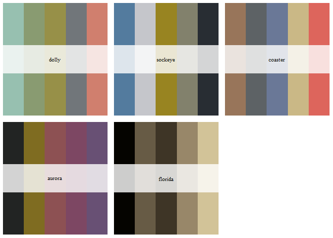

US Fish & Wildlife Service Color Palettes
================

## Description

Inspired by [this
tweet](https://twitter.com/margaretsiple/status/1306695097438801920)
from Dr. Margaret Siple this is a minimal package designed to add color
palettes based on the photos. This package was developed at the same
time DL Miller created [a
gist](https://gist.github.com/dill/1729bbc9ad4f915942045f96a6cfbf9d) to
allow people to use those palettes as well. This package aims to allow
users to install the functions needed to use these palettes.

## How to Get

You can get this package using the remotes pacakge by typing

`remotes::install_github("delabj/USFWSpalettes")`

or with devtools

`remotes::install_github("delabj/USFWSpalettes")`

## What’s Inside

This package contains a few basic functions and lists.

  - `USFWS_palettes`(List of Palettes)
  - `USFWS_palette()`
  - `scale_color_USFWS()`
  - `scale_fill_USFWS()`

## Useage

``` r
library(tidyverse)
library(USFWSpalettes)

# Get a palette
USFWS_palette(5, "aurora", TRUE)
```

<!-- -->

``` r
diamonds %>%
  ggplot(aes(x=cut, fill=cut))+
  geom_bar()+
  theme_minimal()+
  scale_fill_USFWS()+
  labs(title = "Count of Diamonds by Cut")
```

<!-- -->

## Palettes Included

The following is an example of all palettes included.

<!-- -->
